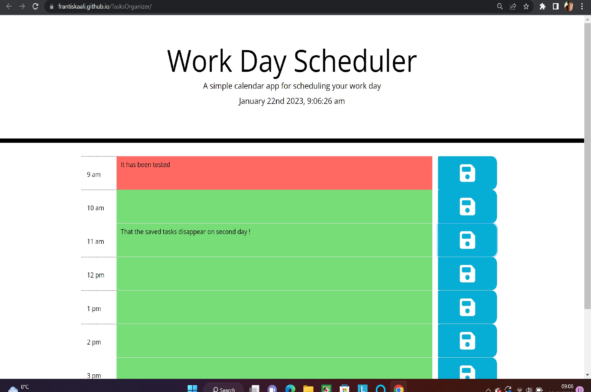

# TaskOrganizer
JQuerry practise challenge project organizer.
## Describtion
Daily office planner created by using JQuery, HTML, Bootstrap. It is interactive website app tha allows user to save his/hers own data.
### What have I learned
While working on this challenge I :
- practise basic JS knowladge, logic
- used and practise JQuerry and its methods
- created loop to dynamically create divs on my html site as well as loop for adding buttons functionality
- practised usie of local storage
- practised and got familiar with momentJS
- practised my Bootstraps skills by adding Bootstraps classes and making sure my website is responsive
## Usage
This daily office hour organizer is designed to organize one work day at a time.
It has color coding to show if the office hour passed , is right now or is gonna happend. Contains live clock in the header. User can put input to each hour of the office day. Tasks can be separately saved on local storage upon clicking the save button, however they are cleared by the second day.
## Screenshot
 you can see how my Tasks Organizer looks overall.
## Link
[HERE](https://frantiskaali.github.io/TasksOrganizer/) you can visit my deployed application.